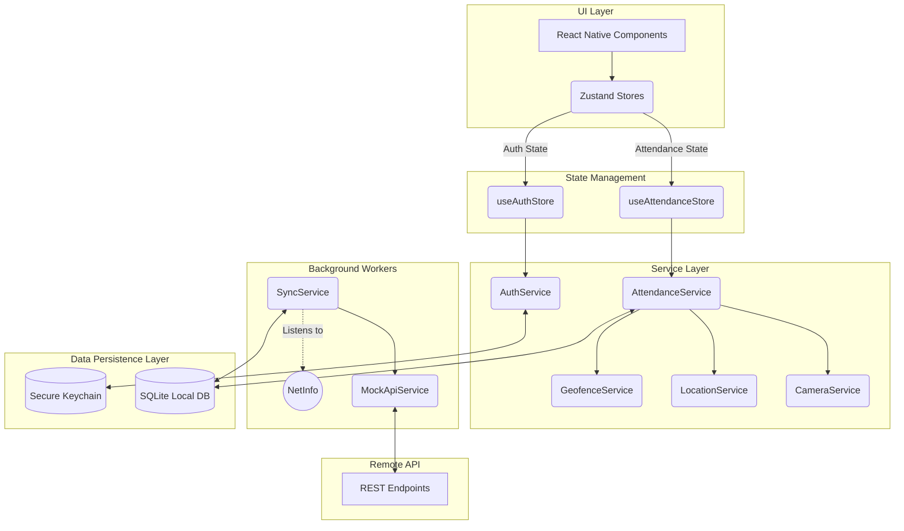

# System Architecture

## Overview
The Employee Attendance Tracker is an **Offline-First** React Native application. It employs a modern modular architecture separating the UI (Presentation Layer), State Management (Zustand), Business Logic (Services), and Data Persistence (SQLite/Keychain).

## Design Patterns Used
1. **Repository Pattern:** All SQLite queries are abstracted into Repository classes (`AttendanceRepository`, `UserRepository`). The UI never interacts with SQL directly.
2. **Service Locator / Facade Pattern:** Business logic (like checking if a GPS coordinate is within a geofence) is abstracted into static Service classes (`GeofenceService`, `AttendanceService`).
3. **Observer Pattern:** Implemented via `Zustand` and `NetInfo`. The UI observes state changes reactively. The `SyncService` observes network state changes to trigger offline syncs.

## Architecture Diagram (Mermaid)

## Data Flow (Offline-to-Online Sync)
1. Device goes offline.
2. User checks in. `AttendanceService` writes to SQLite with `syncStatus = 'pending'`.
3. Device connects to Wi-Fi.
4. `@react-native-community/netinfo` triggers `SyncService`.
5. `SyncService` reads `pending` records from SQLite.
6. `SyncService` sends POST request to `MockApiService` with `Authorization: Bearer <token>`.
7. `SyncService` updates SQLite records to `syncStatus = 'synced'`.
